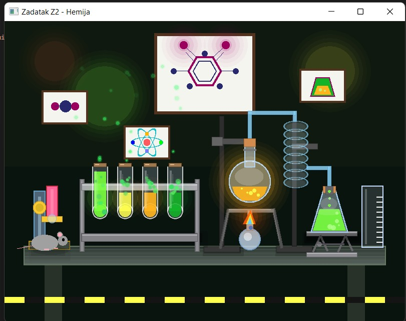

# Interactive Chemistry Lab

Interactive chemistry laboratory simulation developed in C++ using SFML.

## About

This project was created as part of my first-year coursework in Animation Engineering and Computer Graphics at the Faculty of Technical Sciences, University of Novi Sad.

The application presents an animated chemistry laboratory scene with custom-drawn graphical elements and visual effects.

## Features

- Animated test tubes and liquids
- Bubble particle effects
- Laboratory equipment
- Molecule illustrations
- Microscope and burner animations
- Custom 2D scene rendering

## Technologies

- C++
- SFML

## Project Preview

The application renders an interactive chemistry laboratory with animated test tubes, particle effects, molecule illustrations and laboratory equipment using SFML.

## Skills Demonstrated

- Object-Oriented Programming (OOP)
- 2D Graphics Programming
- SFML
- Animation
- Particle Systems
- C++
## Author

Nataša Todorović  
Animation Engineering & Computer Graphics student  
Faculty of Technical Sciences, University of Novi Sad
